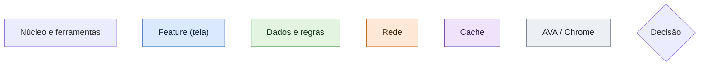
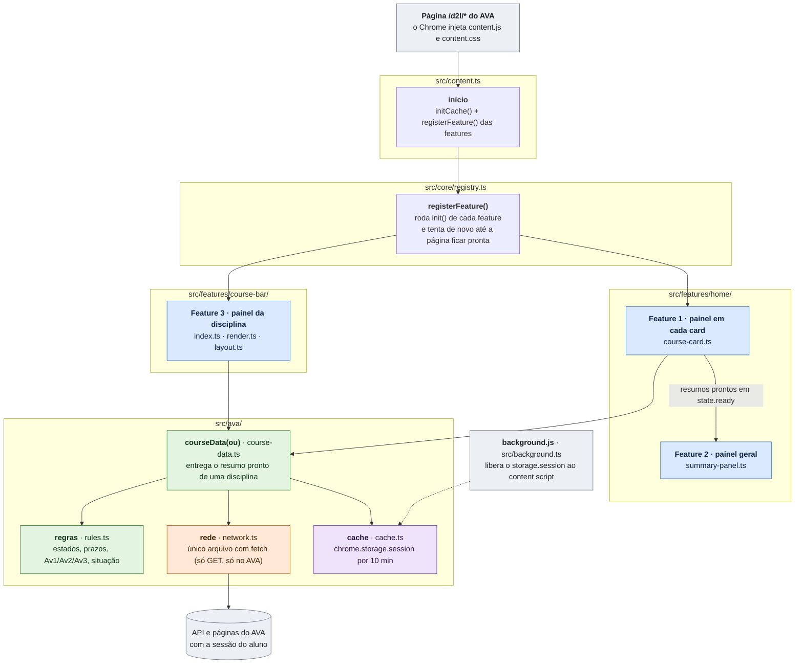
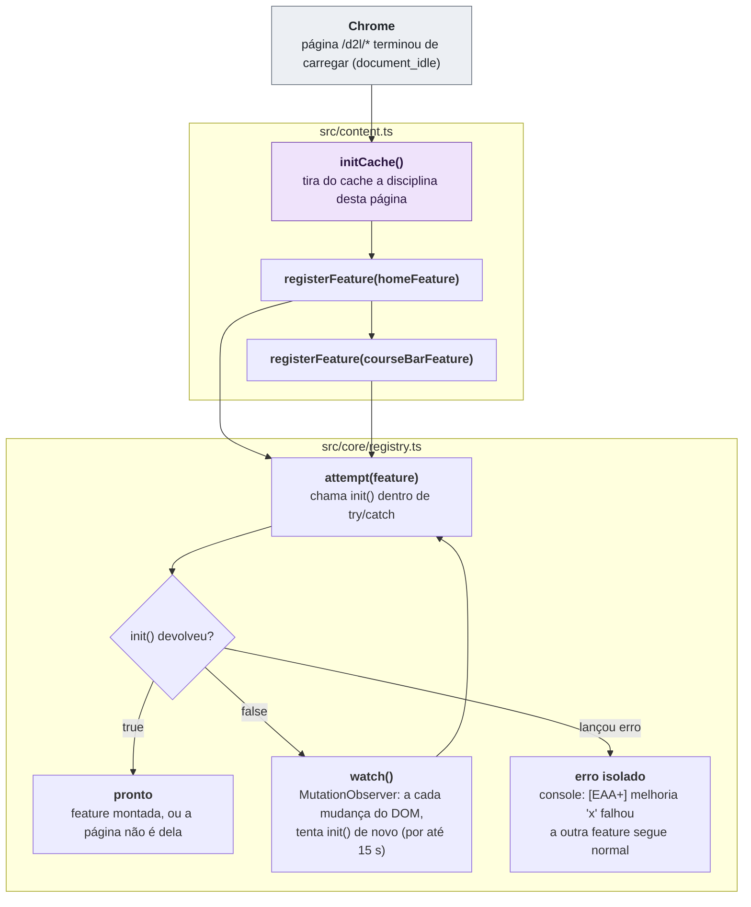
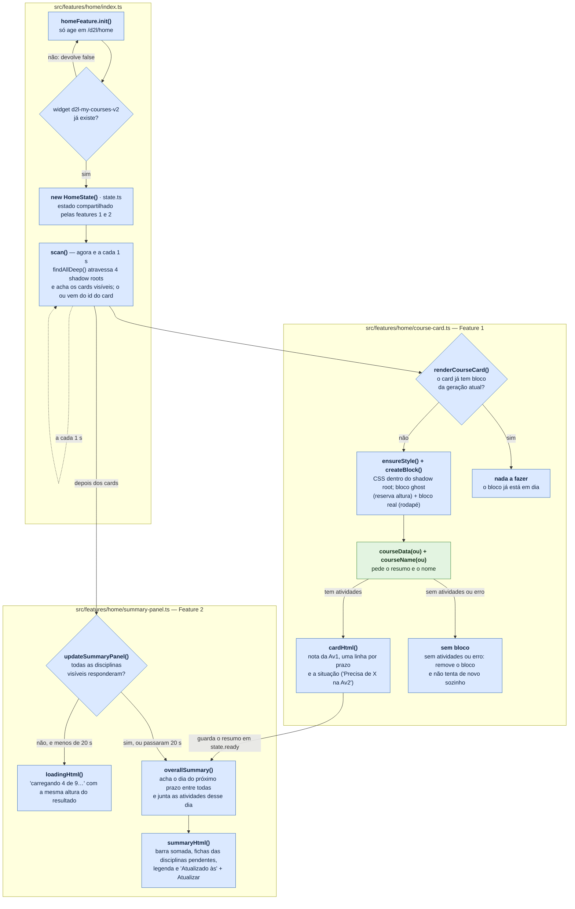
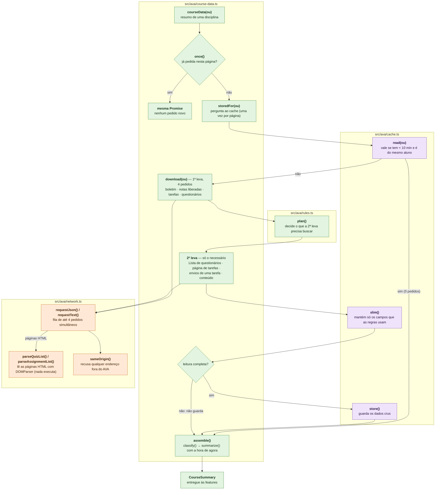
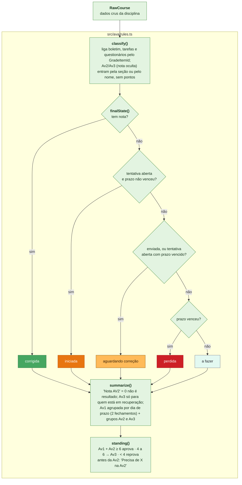
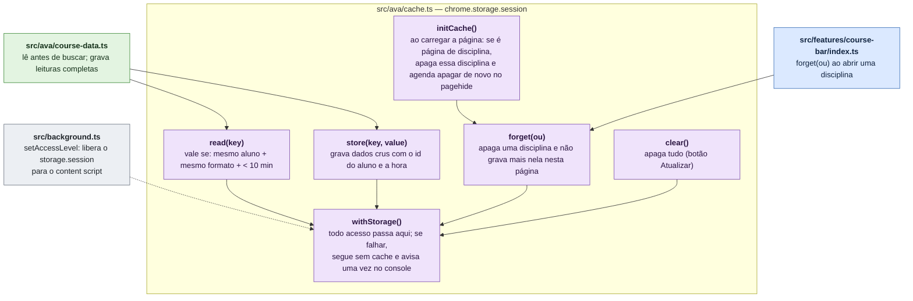
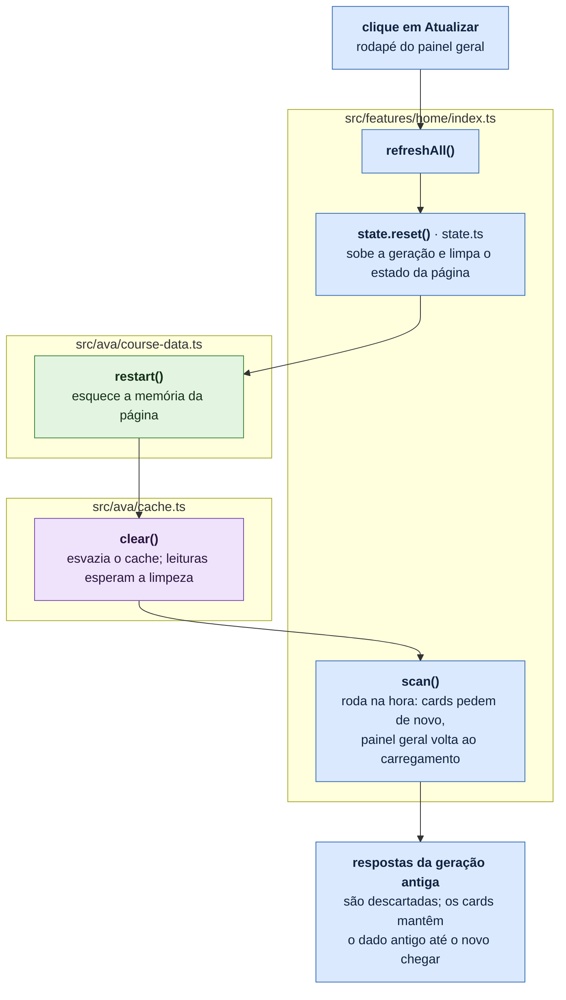
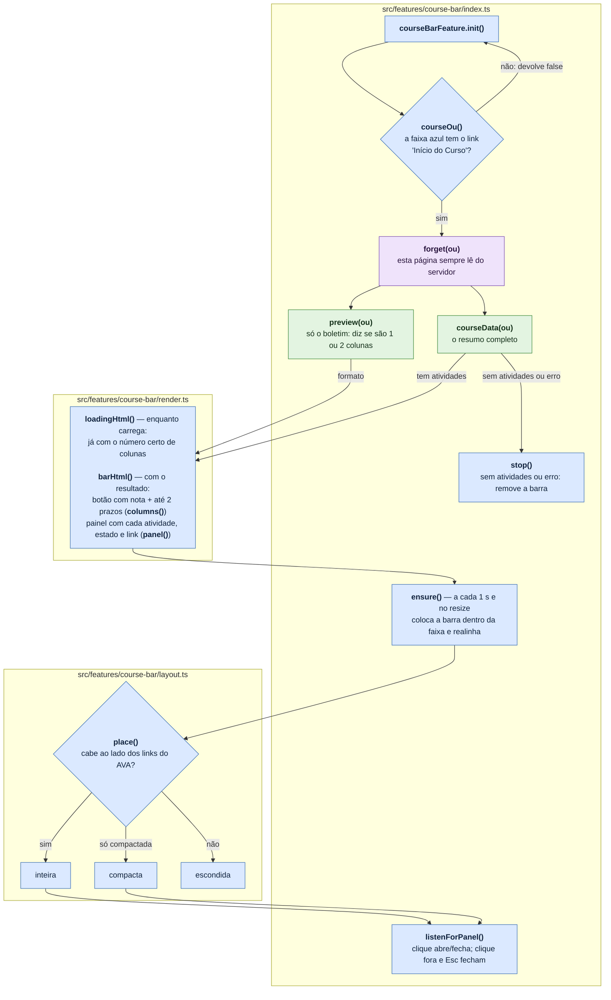
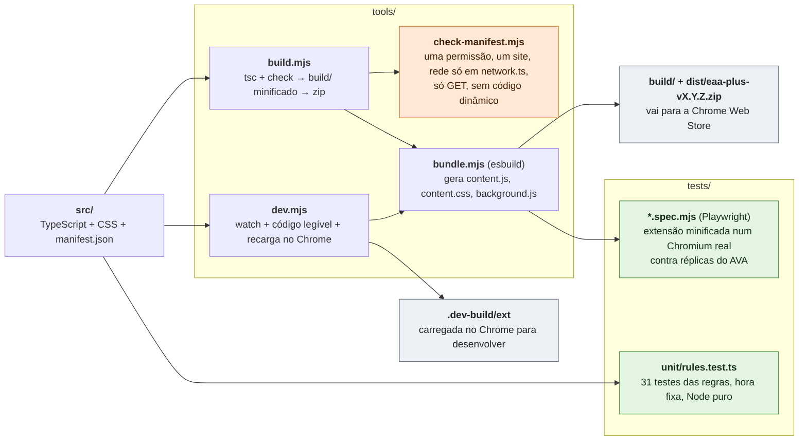

# EAA+ — como funciona e por quê

Cada fluxo da extensão está desenhado abaixo. Em cada bloco, a **função** em
negrito e o que ela faz; cada moldura é um **arquivo**, com o caminho no
título. Embaixo de cada fluxograma, o **porquê** das decisões.

**Legenda de cores**

---

## 1. Visão geral

A extensão mostra, no AVA (Brightspace) da EAA/FABAT, o progresso e os prazos
das avaliações em três lugares: o **painel em cada card** e o **painel geral**
na página inicial, e o **painel da disciplina** em qualquer página de uma
disciplina.

**Por quê**

- **Extensão:** o autor é aluno e não tem acesso de administrador ao AVA; a
  extensão roda com a sessão que o aluno já abriu.
- **As features não acessam a rede:** as features 1 e 3 pedem tudo a
  `courseData()`, e a feature 2 reaproveita os resumos da feature 1. Assim, a
  mesma disciplina nunca é lida duas vezes.
- **Um só padrão de endereço (`/d2l/*`):** cada feature confere sozinha se a
  página é dela; a extensão não roda em nenhum outro site.

---

## 2. Carregamento e registro das features

**Por quê**

- **Tentar de novo por até 15 s:** os componentes do AVA aparecem depois do
  carregamento, em tempos variados. Observar o DOM reage assim que eles surgem;
  o limite evita um observador eterno.
- **Erro isolado:** se o AVA mudar e uma feature quebrar, a outra continua e a
  página não é afetada.
- **Um arquivo só, minificado:** content scripts não aceitam `import`, então o
  esbuild junta os módulos. A loja permite minificar, só proíbe ofuscar.
- **Mundo isolado:** o content script vê o DOM, mas não as variáveis do AVA;
  por isso a extensão faz as próprias leituras.

---

## 3. Página inicial: features 1 e 2

**Por quê**

- **Varredura a cada 1 s:** os cards ficam dentro de 4 shadow roots, que o
  `MutationObserver` não atravessa, e o AVA recria os cards ao trocar de aba.
  A varredura só confere; não refaz o que já está em dia.
- **Só cards visíveis:** abas fechadas só carregam quando abertas.
- **CSS no shadow root, cores em variáveis:** o CSS do manifest não atravessa
  shadow DOM, mas variáveis CSS atravessam (`src/styles/theme.css`).
- **Ghost + real:** títulos de 1 a 3 linhas deixariam os cards desalinhados.
- **Sem nova tentativa após erro:** com varredura por segundo, viraria uma
  leitura por segundo no servidor.
- **Nome pela API:** o texto do card mudou para "Fechada" de um dia para o
  outro.
- **Painel geral espera todas:** somar parcialmente mostraria números errados;
  depois de 20 s mostra o que tiver.

---

## 4. O caminho de um dado: `courseData(ou)`

**Por quê**

- **Duas levas:** buscar só o necessário reduziu a página inicial de 86 para
  49 pedidos.
- **Páginas HTML:** a API responde 403 quando o aluno pede as próprias
  tentativas de questionário; a "Lista de questionários" é a única fonte. A
  página de tarefas traz o envio de todas numa leitura.
- **Ícone, não texto:** "Tentativa em andamento" também aparece em
  questionário já corrigido (é o link de feedback). A tentativa aberta de
  verdade é o ícone na linha.
- **Rede num só arquivo:** o verificador (`tools/check-manifest.mjs`) impede
  o build se houver `fetch` fora dele, sem `sameOrigin` ou diferente de GET.
- **Fila de 4:** evita rajada de pedidos ao abrir a página inicial.
- **Só guarda leitura completa:** um dado parcial nunca é reaproveitado.

---

## 5. As regras: `src/ava/rules.ts`

Funções puras, sem rede e sem DOM, testadas em `tests/unit/rules.test.ts`.

**Por quê**

- **Regras separadas do desenho:** é a parte que mais precisa estar certa;
  um teste quebrado aponta a regra exata.
- **Hora como parâmetro:** o relógio não pode ser falsificado no mundo
  isolado, então os testes usam hora fixa.
- **Fuso de Brasília** (`src/ava/format.ts`): o prazo é o mesmo em qualquer
  computador.
- **Regra de aprovação:** Manual do Aluno EaD 2026, p. 29. O manual não diz
  como a Av3 entra na média, então só a nota dela é mostrada.

---

## 6. O cache entre páginas: `src/ava/cache.ts`

**Por quê**

- **Existe porque o AVA responde `no-store`** e recarrega a página a cada
  clique: sem cache, cada volta à página inicial repetiria as 49 leituras. Com
  ele, a volta custa 0 pedidos, ou só a disciplina visitada.
- **`storage.session`:** só memória, isolado da página, some ao fechar o
  navegador. `localStorage` gravaria notas no disco; `sessionStorage` não vale
  entre abas.
- **Dados crus:** "prazo perdido" depende da hora, então é recalculado a cada
  exibição.
- **Apagar a disciplina ao entrar:** o aluno pode enviar algo ali; ao voltar,
  só essa disciplina é relida.

---

## 7. O botão Atualizar

**Por quê:** recarregar a página faria o AVA baixar de novo cerca de 250
arquivos dele. Manter o dado antigo evita que os cards encolham e cresçam.

---

## 8. Página de uma disciplina: feature 3

**Por quê**

- **Link "Início do Curso":** o endereço muda entre as rotas da disciplina,
  mas esse link está na faixa de todas elas.
- **Dentro da faixa, com posição absoluta:** a página de Conteúdo tem altura
  presa à janela; qualquer elemento no fluxo empurra a aula para fora da tela.
- **Compactar ou esconder:** melhor sumir do que cobrir um link do AVA.
- **`preview()` antes:** o carregamento já nasce com a largura final, então
  nada pula quando o resultado chega.

---

## 9. Build e testes

**Por quê**

- **TypeScript estrito:** o formato dos dados da API fica documentado e
  checado.
- **E2E contra o pacote minificado:** testa exatamente o que vai para a loja.
- **Réplicas com CSS hostil:** as páginas de teste carregam de propósito o CSS
  do AVA que atrapalha elementos inseridos; uma réplica limpa esconderia bugs
  que já aconteceram.

---

## 10. Limites conhecidos

- **O AVA pode mudar sem aviso.** Se os cards, a faixa de navegação, as rotas
  da API ou as duas páginas HTML mudarem, a extensão para em silêncio: o AVA
  fica como era e um aviso `[EAA+]` aparece no console.
- **Só no computador.** O Chrome para celular não roda extensões.
- **Não é fonte oficial.** Em caso de diferença, vale o que está no AVA.
